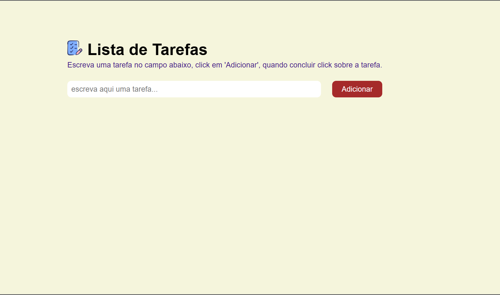
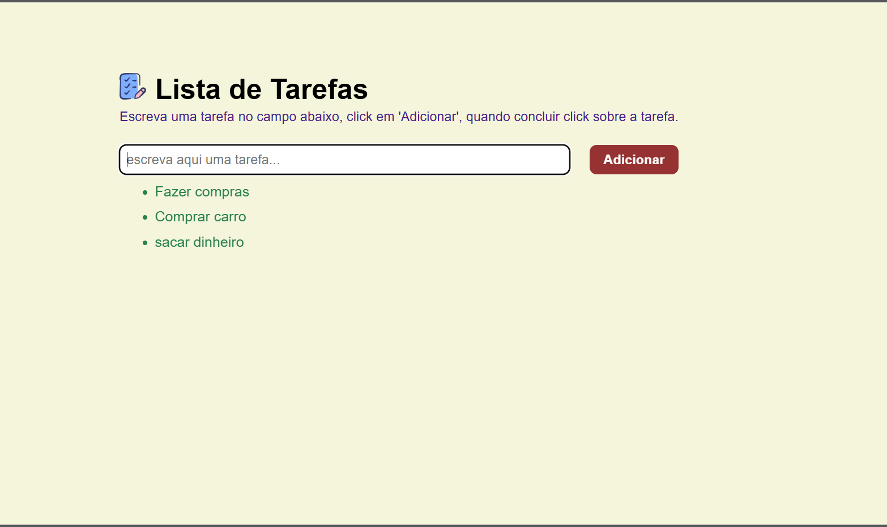
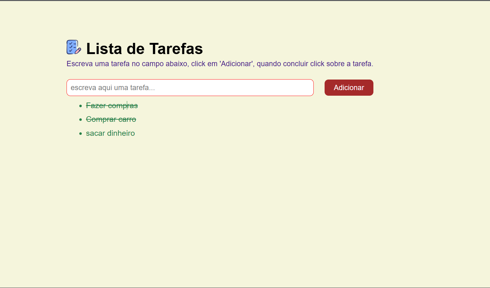

# 📑 Lista de Tarefas
O site permite ao usuário inserir suas tarefas, e marcar se foi resolvido.
<b>
# 📸 Screenshots
<!-- You can add more screenshots here if you like -->
&emsp;&emsp;

# 📲 Como Acessar o site
Para utilizar o site, click no link (segure a tecla ctrl e click no link) gratuitamente já publicado: https://listatarefas-eta.vercel.app/

# 📘 Como Utilizar o Site
 O site é fácil de utilizar, siga os passos abaixo para obter sucesso.<br>
       1. Digite uma tarefa no campo em branco 'digite uma tarefa';<br>
       2. Click em 'Adicionar', e logo verá a sua tarefa inserida abaixo;<br>
       3. Repita a operação 1. e 2. até que atinja a quantidade de tarefas desejado; e<br>
       4. Organização é bom demais.<br>

       obs.: As tarefas não ficarão salvas ao sair do site...

# 💻 Tecnologias
* HTML
* CSS
* Jquery
  - variáveis;
  - funções; e
  - eventos.

# 📖 TO DO
- Melhorar estilização do site.

## 🧔 Author
Maurício G (follow me on [Twitter](https://twitter.com/maumauriciog)).


## 🔖 License
```
The MIT License (MIT)

Copyright (c) 2025 Maurício Gomes das Chagas

Permission is hereby granted, free of charge, to any person obtaining a copy of
this software and associated documentation files (the "Software"), to deal in
the Software without restriction, including without limitation the rights to
use, copy, modify, merge, publish, distribute, sublicense, and/or sell copies of
the Software, and to permit persons to whom the Software is furnished to do so,
subject to the following conditions:

The above copyright notice and this permission notice shall be included in all
copies or substantial portions of the Software.

THE SOFTWARE IS PROVIDED "AS IS", WITHOUT WARRANTY OF ANY KIND, EXPRESS OR
IMPLIED, INCLUDING BUT NOT LIMITED TO THE WARRANTIES OF MERCHANTABILITY, FITNESS
FOR A PARTICULAR PURPOSE AND NONINFRINGEMENT. IN NO EVENT SHALL THE AUTHORS OR
COPYRIGHT HOLDERS BE LIABLE FOR ANY CLAIM, DAMAGES OR OTHER LIABILITY, WHETHER
IN AN ACTION OF CONTRACT, TORT OR OTHERWISE, ARISING FROM, OUT OF OR IN
CONNECTION WITH THE SOFTWARE OR THE USE OR OTHER DEALINGS IN THE SOFTWARE.
```
